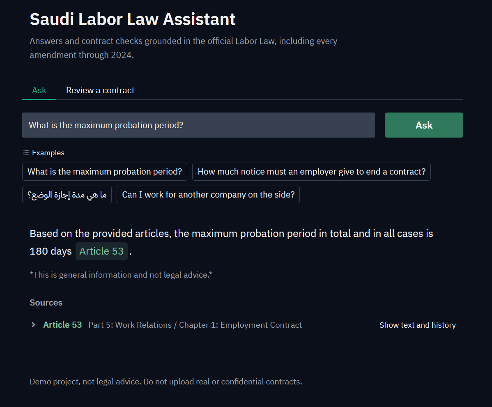
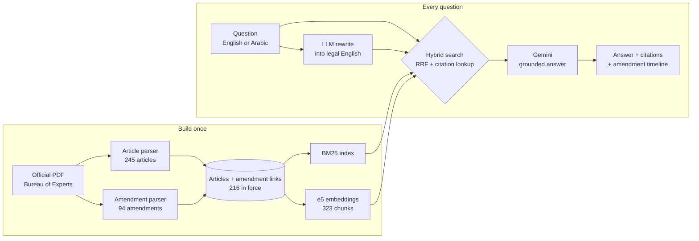
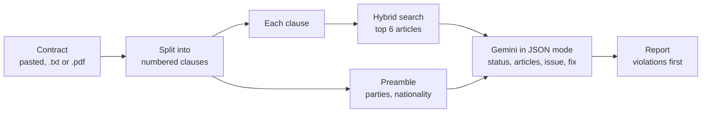

<div align="center">

# Bayan · بيان

**The Saudi Labor Law, as it stands today.**

Question answering and contract review grounded in the official text,
with every answer traced to the article, and the amendment, that is actually in force.


</div>

<p align="center">
  
  <!--  -->
</p>

---

## The problem a naive legal RAG gets wrong

The official English Labor Law is published as the **2005 text plus an appendix of amendments**.
A system that indexes the main text will answer fluently, cite a real article, and be wrong.

| Question | 2005 text says | Law in force says | Changed by |
|---|---|---|---|
| Maximum probation period | 90 days | **180 days in total** | M/44 (2024) |
| Employer's notice, monthly-paid worker | 30 days | **60 days** (employee: 30) | M/44 (2024) |
| Paid marriage leave | 3 days | **5 days** | M/46 (2015) |
| Maternity leave | 10 weeks, partly paid | **12 weeks, fully paid** | M/44 (2024) |
| Weekly rest | 1 day (Friday) | **2 days** | M/46 (2015) |
| Resignation with a future date | not addressed | **not allowed** (Art. 79 bis) | M/44 (2024) |

Bayan parses the amendments, links each one to the articles it changes, and shows the full history:

```
Article 75 · notice period for a monthly-paid worker

2005 ──○── 30 days, either party                         original
2015 ──○── 60 days, either party                         Royal Decree M/46
2024 ──●── employer 60 days, employee 30 days            Royal Decree M/44   ← in force
```

---

## Results at a glance

| | |
|---|---|
| 📄 **Articles parsed** | 245 / 245, with 0 missing, 0 duplicated, 0 empty |
| 📝 **Amendments linked** | 94, from 7 Royal Decrees (2013 to 2024) |
| ⚖️ **Articles in force** | 216 indexed; the 29 repealed articles can never be cited |
| 🔎 **Retrieval** | Hit@1 **27/33**, Hit@3 **31/33**, MRR **0.885** |
| 📑 **Contract review** | **12/12** planted violations caught, **0/13** false alarms |
| 🌐 **Languages** | Questions in English or Arabic; answers in the question's language |

---

## Architecture



**Contract review** reuses the same retrieval, one clause at a time:



---

## How it works

<details open>
<summary><b>1. Parsing the law</b></summary>

- **Source:** the Bureau of Experts' official English translation (69-page PDF). The Arabic original was a 75-page scan with no text layer.
- **One chunk per article**, never fixed-size windows, so a citation always points to exactly one article.
- **A line-by-line state machine** reads Part, Chapter, and Section headings (including titles that wrap onto two lines) and attaches them to each article as metadata.
- **Every run is checked automatically:** article count, missing numbers, duplicates, and empty bodies.

</details>

<details>
<summary><b>2. Amendments, the core of the project</b></summary>

- Each bullet in the appendix becomes one record: date, Hijri date, decree number, action, instruction, and new text.
- Target articles are extracted from instructions such as *"Amending Articles 229, 230 … and 241"*, *"numbered 79 bis"*, or *"Repealing Part 14"* (mapped to Articles 210 to 228).
- Each article gets a status: `original`, `amended`, `repealed`, or `replaced`.
- **The law is never merged automatically.** Amendments are attached in date order, and the model is told that the latest one is in force. Merging legal text by hand-written rules is legal interpretation, and that is where silent errors would come from.

</details>

<details>
<summary><b>3. Hybrid retrieval</b></summary>

| Component | Role | Detail |
|---|---|---|
| **BM25** | Exact legal terms and article numbers | Domain stopwords such as "shall" and "this Law" |
| **multilingual-e5-base** | Meaning and Arabic questions | Original text and each amendment are separate chunks, since the model reads only about 512 tokens; an article's score is its best chunk |
| **Reciprocal Rank Fusion** | Combines both rankings | `score = Σ 1/(60 + rank)`; uses ranks only, so BM25 and cosine scales never need to be compared |
| **Citation lookup** | "Article 109" or "المادة ١٠٩" | An explicitly named article is always ranked first |
| **Query rewriting** | Everyday or Arabic wording into legal English | Adds results only; it can never remove what the original query found |

</details>

<details>
<summary><b>4. Grounded generation</b></summary>

- Answers only from the retrieved articles, cites every claim, and treats the latest amendment as the law in force.
- When the answer isn't in the articles, it refuses with a fixed sentence. Off-topic questions get a short help message instead of a search.
- The interface shows only the articles the answer actually cites, each opening into its amendment timeline.
- Temporary API errors (429 and 5xx) are retried with waits of 5, 10, then 20 seconds, then the next model in a fallback chain is tried.

</details>

<details>
<summary><b>5. Contract review</b></summary>

- Clauses are split by number, and the **preamble is passed with every clause**, because legality can depend on context: an indefinite-term contract is legal for a Saudi worker but not for a non-Saudi one (Art. 37).
- Gemini returns structured JSON: `violation`, `compliant`, or `needs_review`, plus the cited articles, the issue, and suggested wording.
- Clauses that give the worker *more* than the law requires are explicitly treated as compliant.

</details>

---

## Evaluation

### Retrieval: 33 questions

Six kinds of question: the law's own wording, everyday wording, amendment-only answers, article numbers, Arabic questions, and paraphrases.

```
MRR (higher is better)                0 ────────────────────────── 1
BM25                       0.601      ████████████████████░░░░░░░░░░░░░
Embeddings                 0.812      ███████████████████████████░░░░░░
Hybrid (RRF)               0.858      ████████████████████████████░░░░░
Hybrid + citation lookup   0.885      █████████████████████████████░░░░
```

| Method | Hit@1 | Hit@3 | MRR |
|---|---|---|---|
| BM25 | 17/33 | 22/33 | 0.601 |
| Embeddings | 24/33 | 29/33 | 0.812 |
| Hybrid (RRF) | 26/33 | 30/33 | 0.858 |
| **Hybrid + citation lookup** | **27/33** | **31/33** | **0.885** |

**Where each method fails** is the reason hybrid search wins:

| | Fails on |
|---|---|
| **BM25** | All 6 Arabic questions (no shared tokens) and everyday wording ("fire me" vs. "terminate") |
| **Embeddings** | Bare article numbers ("Article 109"), one paraphrase, and an article whose rule exists only in an amendment |
| **Hybrid + lookup** | 2 remaining: the amendment-only article (Art. 234) and one Arabic question, which query rewriting recovers at answer time |

### End-to-end answers

| Question | Expected | Result |
|---|---|---|
| Maximum probation period? | 180 days, from the 2024 amendment | ✅ Article 53, M/44 cited |
| Employer's notice period? | 60 days, from the 2024 amendment | ✅ Article 75, M/44 cited |
| Maternity leave, asked in Arabic: ما هي مدة إجازة الوضع؟ | Answer in Arabic: 12 weeks, fully paid | ✅ Article 151, answered in Arabic |
| Working for another company on the side? | Prohibited without procedure | ✅ Article 39 |
| Penalty for drunk driving? | Out of scope, must refuse | ✅ Refused, nothing invented |

### Contract review: 2 contracts, 25 clauses

| Contract | Designed to test | Violations caught | Right article cited | False alarms |
|---|---|---|---|---|
| Standard | Clear violations (probation, leave, notice, fees, non-compete…) | **8/8** | 8/8 | **0/6** |
| Tricky | Legal clauses that look suspicious, and violations visible only after the amendments | **4/4** | 3/4 → 4/4 | **0/7** |

The tricky contract was run twice. **Verdicts were identical across runs.** One citation varied: Article 2 vs. Article 79 for the "79 bis" resignation rule. A prompt rule now maps added articles to their base number.

> **Caveat:** the evaluation sets are small and were written by the author. They are useful for catching regressions, but they are not proof of accuracy. Questions and contracts written by others are the next step.

---

## Failure log

Every number above came from a failure that was found and fixed.

| # | What broke | How it was found | Fix |
|---|---|---|---|
| 1 | Wrapped chapter titles leaked into article text ("…from Abroad" at the end of Art. 29) | Reading the end of each article | State-machine parser that tracks open headings |
| 2 | Sub-section headings ("Second: Workers' Duties") attached to the wrong article | Same check | Parsed as `section` metadata |
| 3 | Amendment text quotes "Article 39:", which would create duplicate articles | Duplicate-article check | Stop the main parse at the Appendix and parse amendments separately |
| 4 | Regex alternation order dropped the last item in lists ending ", and N" | Expected 29 repealed articles, got 28 | Reordered the alternatives; Articles 14, 208, and 241 are now linked |
| 5 | Embedding model truncates at about 512 tokens, cutting off the newest amendment | Design review | One chunk per original text and per amendment, max-pooled per article |
| 6 | BM25 returned an arbitrary order for Arabic questions (all scores 0) | Hybrid results showed noise | Return nothing when no term matches |
| 7 | "Article 109" missed: embeddings handle numbers poorly | Evaluation set | Direct citation lookup ranks the named article first |
| 8 | Arabic maternity question retrieved the wrong articles, and the model correctly refused | End-to-end check | LLM query rewriting into legal English |
| 9 | Rewriting then lost Article 39 for another question | Re-ran every check after the fix | Rewriting may only add results, never remove them |
| 10 | Rewritten queries added "Saudi Labor Law", which matches every article | Inspecting rewritten queries | Prompt forbids adding the law's name |
| 11 | Gemini returned 503 (overloaded) on every call | Runtime | Retry with growing waits, plus a model fallback chain |
| 12 | "What can you do?" showed 8 irrelevant articles under a refusal | Manual testing | Off-topic detection, and only cited sources are shown |

---

## Run it locally

```bash
python -m venv .venv
.venv\Scripts\activate              # macOS/Linux: source .venv/bin/activate
pip install -r requirements.txt
```

Get a free key at [aistudio.google.com](https://aistudio.google.com), then:

```bash
# PowerShell; on macOS/Linux use: export GEMINI_API_KEY=...
$env:GEMINI_API_KEY="your-key"

python src/parse_law_en.py          # 245 articles
python src/parse_amendments_en.py   # 94 amendments, then statuses
python src/compare.py               # retrieval evaluation table
python src/review_contract.py data/contracts/sample_contract_tricky_en.txt
python app.py                       # http://127.0.0.1:7860
```

<details>
<summary><b>Project structure</b></summary>

```
bayan/
├── app.py                        web interface (Gradio)
├── src/
│   ├── parse_law_en.py           PDF → 245 articles with metadata
│   ├── parse_amendments_en.py    appendix → 94 amendments → statuses
│   ├── search_bm25.py            keyword search
│   ├── search_embed.py           multilingual embedding search + cache
│   ├── hybrid.py                 RRF fusion + citation lookup
│   ├── evaluate.py               33-question test set, Hit@k, MRR
│   ├── compare.py                side-by-side retrieval evaluation
│   ├── answer.py                 rewriting, grounded answers, retries
│   └── review_contract.py        clause-level review + scoring
└── data/
    ├── raw/                      official PDF + extracted text
    ├── processed/                articles, amendments, embedding cache
    └── contracts/                test contracts + answer keys
```

</details>

---

## Limitations and next steps

- **The Arabic text is the legally binding version.** The English translation is published for guidance only. Parsing the Arabic version means handling article numbers written as words (المادة الخامسة والسبعون), inserted articles (مكرر), and renumbered ones (حالياً / سابقاً).
- **Amendments are attached, not consolidated.** Producing a consolidated "current text" would need legal review.
- **The evaluation sets are small and self-written.** Next: questions written by others, and contracts drafted by a lawyer.
- **More laws:** the Civil Transactions Law (2023) is the natural next corpus.
- **Pin model versions.** `-latest` aliases can change behaviour without notice.

---

<sub>Built as a portfolio project. Design decisions, evaluation, and debugging are documented above. Test contracts are synthetic. Not legal advice.</sub>